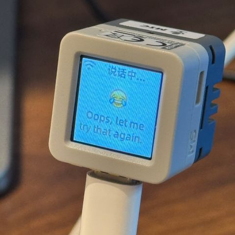
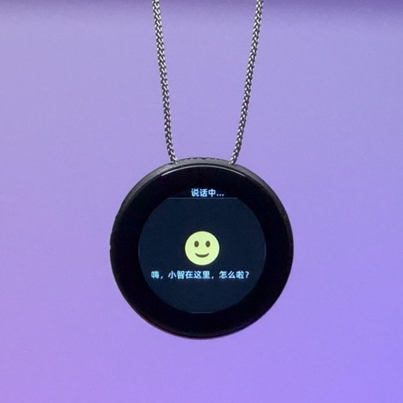

# روبوت دردشة مبني على MCP

(العربية | [English](README.md) | [中文](README_zh.md) | [日本語](README_ja.md))

## مخطط توصيل ESP32-S3 لمشروعك (مع PSRAM)

هذه النسخة من المستودع مخصصة لوحدة ESP32-S3 المزودة بذاكرة PSRAM خارجية.

### الشاشة (ST7789 بدقة 240x240 عبر SPI)

| إشارة الشاشة | GPIO في ESP32-S3 |
|---|---|
| SCK | GPIO7 |
| MOSI | GPIO6 |
| RST | GPIO15 |
| DC | GPIO16 |
| CS | GPIO5 |
| BL | GPIO17 |

### وحدة الميكروفون (I2S RX، نوع INMP441/ICS43434)

| إشارة الميكروفون | GPIO في ESP32-S3 |
|---|---|
| BCLK | GPIO44 |
| LRCK / WS | GPIO9 |
| DOUT / SD | GPIO1 |
| L/R | GND |

### وحدة السماعة/المضخم (I2S TX، نوع MAX98357)

| إشارة المضخم | GPIO في ESP32-S3 |
|---|---|
| BCLK | GPIO7 |
| LRCK | GPIO4 |
| DIN | GPIO2 |
| SD | VIN |
| GAIN | GND |`n`n## المقدمة

👉 [الإنسان: يضيف كاميرا للذكاء الاصطناعي vs الذكاء الاصطناعي: يكتشف فورًا أن صاحبه لم يغسل شعره منذ 3 أيام【bilibili】](https://www.bilibili.com/video/BV1bpjgzKEhd/)

👉 [اصنع صديقتك الذكية AI يدويًا - دليل للمبتدئين【bilibili】](https://www.bilibili.com/video/BV1XnmFYLEJN/)

روبوت XiaoZhi AI هو مدخل للتفاعل الصوتي، ويستفيد من قدرات النماذج الكبيرة مثل Qwen وDeepSeek، ويحقق التحكم متعدد الأطراف عبر بروتوكول MCP.

## ملاحظات الإصدار

الإصدار الحالي v2 غير متوافق مع جدول التقسيم الخاص بـ v1، لذلك لا يمكن الترقية من v1 إلى v2 عبر OTA. تفاصيل جدول التقسيم موجودة في [partitions/v2/README.md](partitions/v2/README.md).

يمكن ترقية الأجهزة التي تعمل بإصدار v1 إلى v2 عبر التفليش اليدوي.

الإصدار المستقر من v1 هو 1.9.2. يمكنك الانتقال إلى v1 عبر الأمر `git checkout v1`. سيتم الاستمرار في صيانة فرع v1 حتى فبراير 2026.

### الميزات المنفذة

 ● Wi-Fi / ML307 Cat.1 4G

 ● تنبيه صوتي محلي بدون إنترنت [ESP-SR](https://github.com/espressif/esp-sr)

 ● يدعم بروتوكولي اتصال ([Websocket](docs/websocket.md) أو MQTT+UDP)

 ● يستخدم ترميز OPUS للصوت

 ● تفاعل صوتي قائم على معمارية ASR + LLM + TTS المتدفقة

 ● تمييز المتحدث الحالي [3D Speaker](https://github.com/modelscope/3D-Speaker)

 ● دعم OLED / LCD وعرض الإيموجي

 ● عرض البطارية وإدارة الطاقة

 ● دعم تعدد اللغات (الصينية، الإنجليزية، اليابانية)

 ● دعم منصات ESP32-C3 وESP32-S3 وESP32-P4

 ● MCP على الجهاز للتحكم بالأجهزة (السماعة، LED، السيرفو، GPIO، إلخ)

 ● MCP على السحابة لتوسيع قدرات النموذج الكبير (المنزل الذكي، التحكم بسطح المكتب، البحث المعرفي، البريد، إلخ)

 ● تخصيص كلمات التنبيه والخطوط والإيموجي وخلفيات الدردشة عبر الويب ([مولد الأصول المخصص](https://github.com/78/xiaozhi-assets-generator))

## العتاد

### تجربة تركيب على Breadboard

راجع دليل Feishu:

👉 ["موسوعة روبوت XiaoZhi AI"](https://ccnphfhqs21z.feishu.cn/wiki/F5krwD16viZoF0kKkvDcrZNYnhb?from=from_copylink)

صورة توضيحية للتجربة:

### يدعم أكثر من 70 لوحة/عتاد مفتوح المصدر (جزء منها)

- <a href="https://oshwhub.com/li-chuang-kai-fa-ban/li-chuang-shi-zhan-pai-esp32-s3-kai-fa-ban" target="_blank" title="LiChuang ESP32-S3 Development Board">LiChuang ESP32-S3 Development Board</a>
- <a href="https://github.com/espressif/esp-box" target="_blank" title="Espressif ESP32-S3-BOX3">Espressif ESP32-S3-BOX3</a>
- <a href="https://docs.m5stack.com/zh_CN/core/CoreS3" target="_blank" title="M5Stack CoreS3">M5Stack CoreS3</a>
- <a href="https://docs.m5stack.com/en/atom/Atomic%20Echo%20Base" target="_blank" title="AtomS3R + Echo Base">M5Stack AtomS3R + Echo Base</a>
- <a href="https://gf.bilibili.com/item/detail/1108782064" target="_blank" title="Magic Button 2.4">Magic Button 2.4</a>
- <a href="https://www.waveshare.net/shop/ESP32-S3-Touch-AMOLED-1.8.htm" target="_blank" title="Waveshare ESP32-S3-Touch-AMOLED-1.8">Waveshare ESP32-S3-Touch-AMOLED-1.8</a>
- <a href="https://github.com/Xinyuan-LilyGO/T-Circle-S3" target="_blank" title="LILYGO T-Circle-S3">LILYGO T-Circle-S3</a>
- <a href="https://oshwhub.com/tenclass01/xmini_c3" target="_blank" title="XiaGe Mini C3">XiaGe Mini C3</a>
- <a href="https://oshwhub.com/movecall/cuican-ai-pendant-lights-up-y" target="_blank" title="Movecall CuiCan ESP32S3">CuiCan AI Pendant</a>
- <a href="https://github.com/WMnologo/xingzhi-ai" target="_blank" title="WMnologo-Xingzhi-1.54">WMnologo-Xingzhi-1.54TFT</a>
- <a href="https://www.seeedstudio.com/SenseCAP-Watcher-W1-A-p-5979.html" target="_blank" title="SenseCAP Watcher">SenseCAP Watcher</a>
- <a href="https://www.bilibili.com/video/BV1BHJtz6E2S/" target="_blank" title="ESP-HI Low Cost Robot Dog">ESP-HI Low Cost Robot Dog</a>

  
  
  
  
  
  
  
  
  
  
  
  

## البرمجيات

### تفليش البرنامج الثابت

للمبتدئين، يُنصح باستخدام إصدار يمكن تفليشه بدون إعداد بيئة تطوير.

البرنامج يتصل افتراضيًا بخادم [xiaozhi.me](https://xiaozhi.me). يمكن للمستخدمين الأفراد إنشاء حساب واستخدام نموذج Qwen اللحظي مجانًا.

👉 [دليل التفليش للمبتدئين](https://ccnphfhqs21z.feishu.cn/wiki/Zpz4wXBtdimBrLk25WdcXzxcnNS)

### بيئة التطوير

 ● Cursor أو VSCode

 ● تثبيت إضافة ESP-IDF واختيار SDK إصدار 5.4 أو أحدث

 ● لينكس أفضل من ويندوز من ناحية سرعة البناء وتقليل مشاكل التعريفات

 ● هذا المشروع يستخدم أسلوب Google C++، يرجى الالتزام به عند إرسال المساهمات

### توثيق المطور

● <a href="docs/custom-board.md">دليل اللوحة المخصصة</a> - تعلم كيفية إنشاء لوحات مخصصة لـ XiaoZhi AI  
● <a href="docs/mcp-usage.md">استخدام MCP للتحكم في IoT</a> - التحكم في أجهزة إنترنت الأشياء عبر MCP  
● <a href="docs/mcp-protocol.md">تدفق بروتوكول MCP</a> - تطبيق MCP على جانب الجهاز  
● <a href="docs/mqtt-udp.md">وثيقة بروتوكول MQTT + UDP</a>  
● <a href="docs/websocket.md">وثيقة بروتوكول WebSocket التفصيلية</a>

## إعداد النموذج الكبير

إذا كان لديك جهاز XiaoZhi AI ومتصل بالخادم الرسمي، يمكنك تسجيل الدخول إلى لوحة [xiaozhi.me](https://xiaozhi.me) لإجراء الإعدادات.

👉 [فيديو شرح لوحة التحكم (الواجهة القديمة)](https://www.bilibili.com/video/BV1jUCUY2EKM/)

## مشاريع مفتوحة المصدر ذات صلة

للنشر على خادم شخصي، راجع المشاريع التالية:

- [xinnan-tech/xiaozhi-esp32-server](https://github.com/xinnan-tech/xiaozhi-esp32-server) خادم Python
- [joey-zhou/xiaozhi-esp32-server-java](https://github.com/joey-zhou/xiaozhi-esp32-server-java) خادم Java
- [AnimeAIChat/xiaozhi-server-go](https://github.com/AnimeAIChat/xiaozhi-server-go) خادم Golang
- [hackers365/xiaozhi-esp32-server-golang](https://github.com/hackers365/xiaozhi-esp32-server-golang) خادم Golang

مشاريع عميل أخرى تستخدم بروتوكول XiaoZhi:

- [huangjunsen0406/py-xiaozhi](https://github.com/huangjunsen0406/py-xiaozhi) عميل Python
- [TOM88812/xiaozhi-android-client](https://github.com/TOM88812/xiaozhi-android-client) عميل Android
- [100askTeam/xiaozhi-linux](http://github.com/100askTeam/xiaozhi-linux) عميل Linux من 100ask
- [78/xiaozhi-sf32](https://github.com/78/xiaozhi-sf32) برنامج ثابت لشريحة بلوتوث من Sichuan
- [QuecPython/solution-xiaozhiAI](https://github.com/QuecPython/solution-xiaozhiAI) برنامج QuecPython من Quectel

أدوات الأصول المخصصة:

- [78/xiaozhi-assets-generator](https://github.com/78/xiaozhi-assets-generator) مولد الأصول المخصصة (كلمة التنبيه، الخطوط، الإيموجي، الخلفيات)

## عن المشروع

هذا مشروع ESP32 مفتوح المصدر، مرخّص تحت MIT، ويمكن لأي شخص استخدامه مجانًا بما في ذلك الاستخدام التجاري.

نأمل أن يساعد هذا المشروع الجميع على فهم تطوير عتاد الذكاء الاصطناعي وتطبيق النماذج اللغوية الكبيرة سريعة التطور على أجهزة حقيقية.

إذا كانت لديك أفكار أو اقتراحات، يمكنك فتح Issue أو الانضمام إلى [Discord](https://discord.gg/bXqgAfRm) أو مجموعة QQ: 994694848.

## سجل النجوم

<a href="https://star-history.com/#78/xiaozhi-esp32&Date">
 <picture>
   <source media="(prefers-color-scheme: dark)" srcset="https://api.star-history.com/svg?repos=78/xiaozhi-esp32&type=Date&theme=dark" />
   <source media="(prefers-color-scheme: light)" srcset="https://api.star-history.com/svg?repos=78/xiaozhi-esp32&type=Date" />
   
 </picture>
</a>
